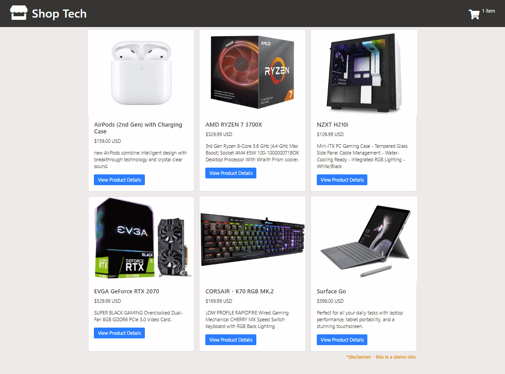

# Shop Tech

A full stack LAMP & React shopping cart app to find the latest tech deals.

## Technologies Used

- React.js
- Webpack 4
- Bootstrap 4
- PHP
- mySQL
- HTML5
- CSS3
- AWS EC2

## Live Demo

Try the application live at [https://shop-tech.christinele.dev/](https://shop-tech.christinele.dev/)

## Features

- Shoppers can view a product list of tech deals.
- Shoppers can view their current item count in the shopping cart.
- Shoppers can view more product details.
- Shoppers can add product(s) to their shopping cart.
- Shoppers can view their shopping cart.
- Shoppers can remove item(s) from their shopping cart.
- Shoppers can proceed to checkout form.
- Shoppers can purchase the item(s) by inputting payment details.
- Shoppers can see a confirmation page after purchasing.

## Preview



## Development

#### System Requirements

- NPM 6 or higher

#### Getting Started

1. Clone the repository.

    ```shell
    git clone https://github.com/codechristine/shop-tech
    cd shop-tech
    ```

1. Install all dependencies with NPM.

    ```shell
    npm install
    ```

1. Import the example database to mySQL.

    ```shell
    mySQLimport --db shop-tech database/shop-tech.sql
    ```

1. Start the project. Once started you can view the application by opening http://localhost:3000 in your browser.

    ```shell
    npm run dev
    ```
